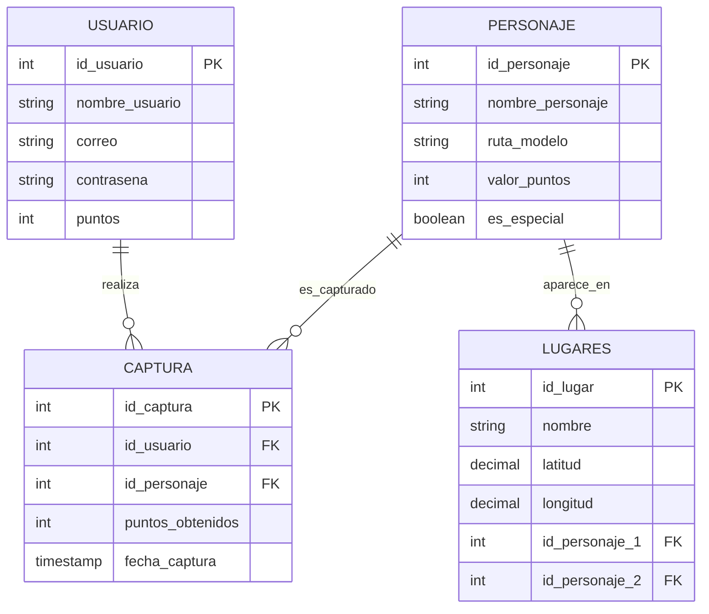

# Diagrama Entidad-Relación

A continuación se presenta el diagrama de la base de datos utilizando la sintaxis de Mermaid.

## Descripción del Diagrama
- **USUARIO - CAPTURA**: Relación de uno a muchos. Un usuario puede tener múltiples registros de captura.
- **PERSONAJE - CAPTURA**: Relación de uno a muchos. Un personaje puede ser capturado por muchos usuarios distintos.
- **PERSONAJE - LUGARES**: Relación de uno a muchos. Un personaje puede estar asignado a varios lugares (aunque en el diseño actual cada lugar tiene dos FKs hacia Personaje).
